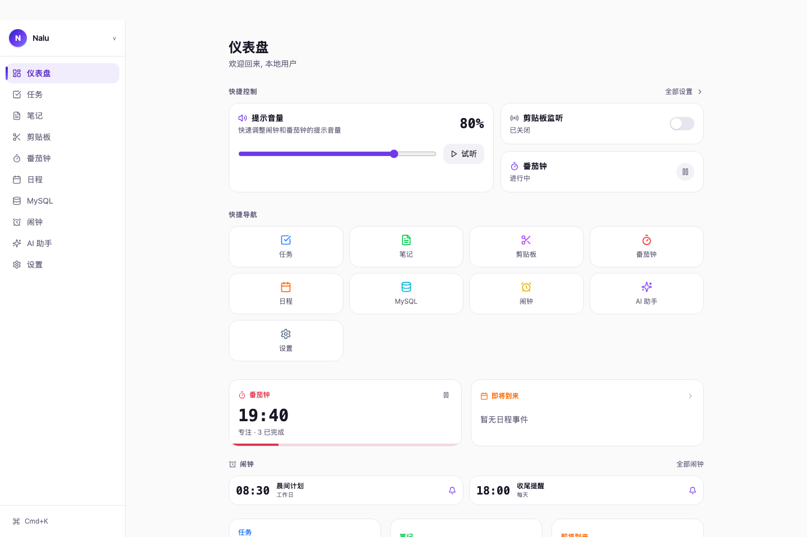
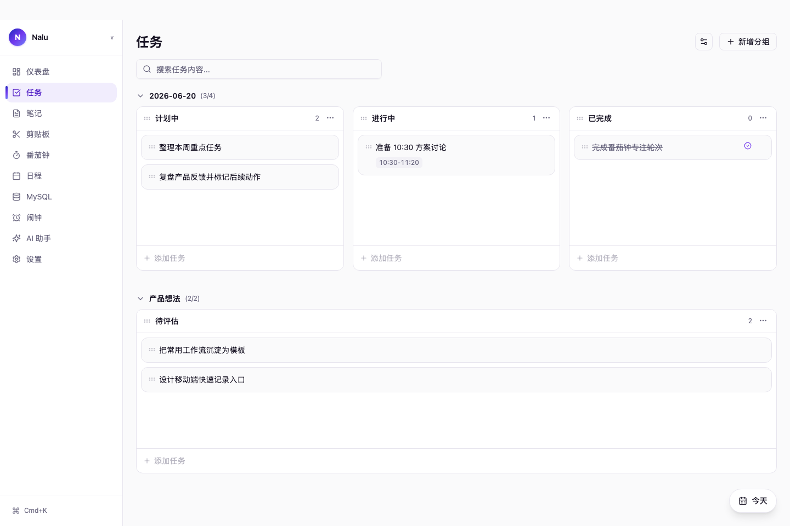
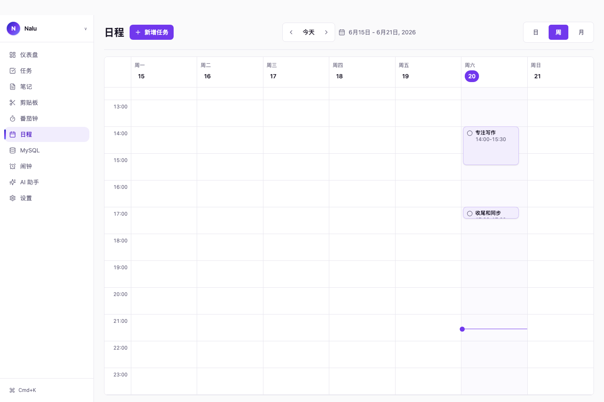

# Nalu

Nalu 是一个本地优先的个人助手应用，用来把日常工作里的任务、日程、笔记、剪贴板、番茄钟、提醒和本地工具集中到一个桌面/移动端体验里。它基于 Tauri 2 构建，前端使用 Vue 3 + Vue Router + Pinia + TypeScript + Vite + Tailwind CSS 4。

> 下方截图均通过 mock 数据生成，只包含示例任务、示例日程和示例笔记；未读取本地数据库、剪贴板、账号、路径或任何真实隐私内容。

## 应用截图

### 仪表盘

仪表盘聚合常用入口、提示音量、剪贴板监听状态、番茄钟状态、近期任务和即将到来的日程，适合作为日常工作入口。



### 任务看板

任务页支持按分组和状态列管理任务，适合做每日计划、项目事项拆分、拖拽排序、批量处理和按日期联动日程任务。



### 日程视图

日程页提供日/周/月视图，把带时间的任务放进日历中管理，并支持提醒、重复任务和拖拽调整时间。



### 移动端任务页

移动端保留核心任务、笔记、番茄钟和设置入口，任务页针对窄屏做了触控友好的列表、分组、列管理和拖拽体验。


## 核心功能

- **任务与看板**：按项目、日期或自定义分组管理任务，支持状态列、拖拽、批量完成、批量移动和删除恢复。
- **日程任务联动**：任务可以挂载开始/结束时间，进入日/周/月日历视图，并支持提醒和重复任务。
- **笔记**：用于记录备忘、会议纪要、模板和临时想法。
- **番茄钟与提醒**：提供专注/休息循环、提示音、闹钟和全局通知。
- **剪贴板管理**：本地保存剪贴板历史，支持快捷调出和清理策略。
- **AI 助手入口**：保留本地配置的 AI 对话入口，适合把个人工作上下文和工具流程整合起来。
- **本地工具**：包含 MySQL 管理和私有同步等面向个人工作台的辅助能力。

## 隐私与本地优先

Nalu 默认面向本地运行场景设计。个人任务、笔记、提醒和工具配置优先保存在本机；README 中展示的图片由 `scripts/generate-readme-screenshots.mjs` 注入 mock 数据生成，不包含真实用户数据。

## 许可证

[MIT](LICENSE)

## 环境要求

- Node.js 20+
- pnpm
- Rust 工具链及 Tauri 平台依赖

## 开发

```bash
pnpm install
pnpm dev
```

启动桌面应用：

```bash
pnpm tauri:dev
```

生成 README 示例截图：

```bash
pnpm dev
pnpm docs:screenshots
```

## 验证

```bash
pnpm check
pnpm test
pnpm test:e2e
pnpm build
```

## 安全说明

本项目为本地桌面应用，信任本地运行环境。部分 Tauri 命令（如数据库查询、Shell 执行）具有较高权限，仅应在本地使用，不适合多用户或远程部署场景。

## 参与贡献

参见 [CONTRIBUTING.md](CONTRIBUTING.md)。

## 架构

- [架构概述](docs/ARCHITECTURE.md)
- [技术栈](docs/TECH_STACK.md)
